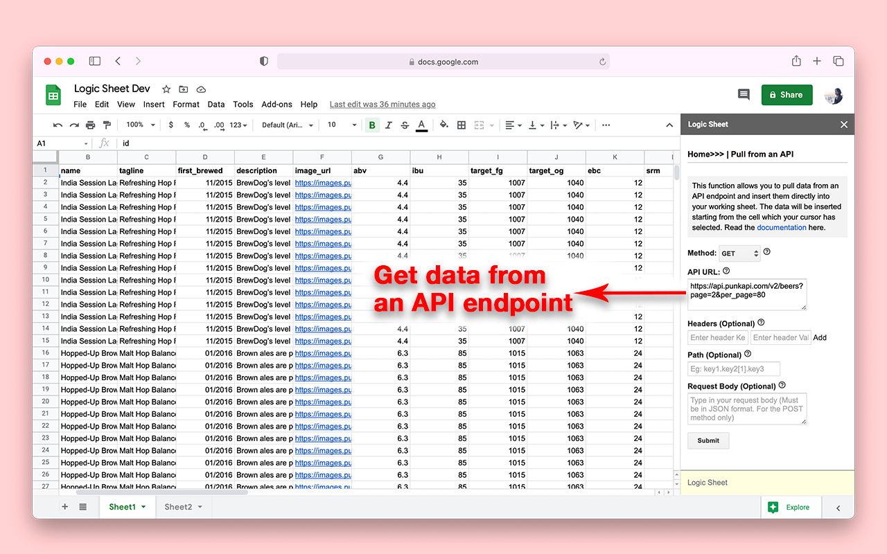
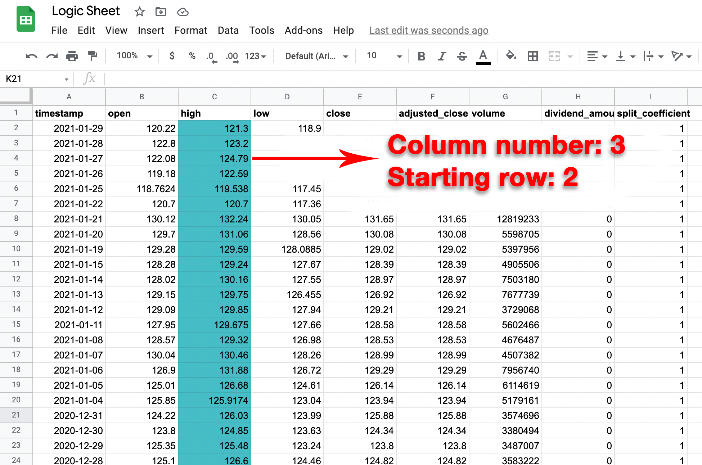
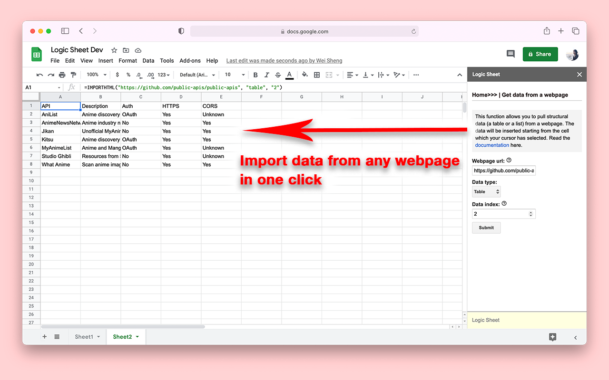
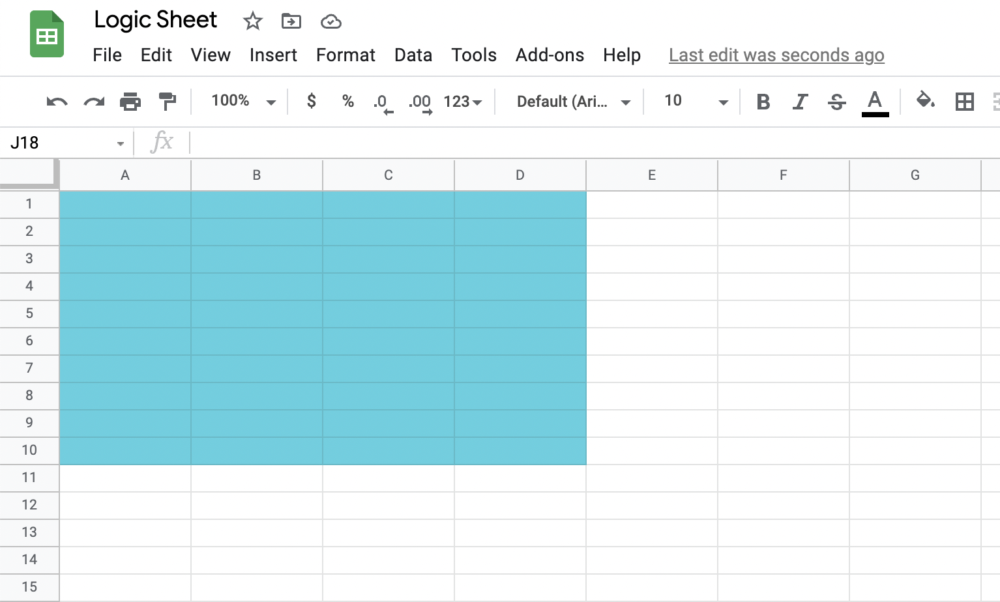

# Logic Sheet documentation

Thanks for using the Logic Sheet Google Workspace add-on. Logic Sheet is an all-in-one data processing tool for Google Sheets. You can use it to pull data from an API, enrich your spreadsheet with an external API, sort your data, and do math.

## Table of contents
- [Work with APIs](#work-with-apis)
    - [Pull from an API](#pull-from-an-api)
    - [Enrich with an API](#enrich-with-an-api)
- [Get data](#get-data)
    - [Get data from a database](#get-data-from-a-database)
    - [Get data from a webpage](#get-data-from-a-webpage)
- [Sort data](#sort-data)
    - [Unpivot data](#unpivot-data)
- [Clean and format data](#clean-and-format-data)
    - [Remove duplicate rows](#remove-duplicate-rows)
    - [Change text casing](#change-text-casing)
    - [Round numbers](#round-numbers)
    - [Clean data](#clean-data)
    - [Unix time converter](#unix-time-converter)
- [Calculate](#calculate)
    - [Insert running totals](#insert-running-totals)
    - [Insert growth rate](#insert-growth-rate)
- [Finance](#finance)
    - [Alpha Vantage API key](#alpha-vantage-api-key)
    - [Get share prices](#get-share-prices)
    - [Fundamental information](#fundamental-information)
    - [Forex rates](#forex-rates)
    - [Cryptocurrency rates](#cryptocurrency-rates)

## Work with APIs
This section will cover how to use Logic Sheet's API-related functions.

### Pull from an API

**Method:** Chose the http method to pull data from an API endpoint. Currently we only support the GET and POST methods, though we will add more. Please check your API reference to decide which method you want to use.

**API url:** Type in the url and full path of the API endpoint, including all parameters. Parameters are usually used to pass in API keys for simple authentication methods.

For example: https://mydata.com/api/v2/dataset1?para1=value1&api_key=keyvalue

**Headers** Headers let you pass additional information with the API request. Request headers can be used in the request to provide information about the request context to help the server tailor the response. You can use, for example, the Authorization header to provide authentication credentials.

If the server responded with a 401 Unauthorized status, usually you should provide credentials to authenticate the request. To do so, you will need to use the Authorization header.

The value of the the Authorization header should be :

    <type> <credentials>

_Common types_:
- Basic: Base64-encoded credentials.
- Bearer: Bearer tokens to access OAuth 2.0-protected resources

**Path:** If provided, the funtion will only retrieve data that is located in the path. For example, You can enter key1.key2[1].key3 to retrieve to value of key3 of the second object of array key2 of the object key1.

If the JSON response looks like this:

    {
        "id": 1001,
        "person": [
            {
                "name": "John",
                "age": 45,
                "city": "New York"
            },
            {
                "name": "Rich",
                "age": 34,
                "city": "London"
            }
        ]
    }

the path person[1].name will return "Rich", while the path person[0] will return all information about John.

**Request body:** Enter the JSON format request body. This will only apply to the POST method. For example, when creating a resource using POST, the request body usually contains the representation of the resource to be created.

### Enrich with an API

**Column number:** Type in the number of column of the data to be processed. For example, column C should be 3.

**Start row:** Type in the number of the start row of the data to be processed.

This function will only process a column of data, so you have to choose which column and from which row you want the data to be processed. This is an example:

**Method:** Chose the http method to send data to an API endpoint. Currently we only support the GET and POST methods, though we will add more. Please check your API reference to decide which method you want to use.

**API url:** Type in the url and full path of the API endpoint, including all parameters. Parameters are usually used to pass in API keys for simple authentication methods.

You can also include {{merge_tag}} in the url parameters to represent data from the sheet to be sent to the API endpoint. 

For example: https://mydata.com/api/v2/dataset1?api_key=keyvalye&data={{merge_tag}}

**Headers** Headers let you pass additional information with the API request. Request headers can be used in the request to provide information about the request context to help the server tailor the response. You can use, for example, the Authorization header to provide authentication credentials.

If the server responded with a 401 Unauthorized status, usually you should provide credentials to authenticate the request. To do so, you will need to use the Authorization header.

The value of the the Authorization header should be :

    <type> <credentials>

_Common types_:
- Basic: Base64-encoded credentials.
- Bearer: Bearer tokens to access OAuth 2.0-protected resources

**Path:** If provided, the funtion will only retrieve data that is located in the path. For example, You can enter key1.key2[1].key3 to retrieve to value of key3 of the second object of array key2 of the object key1.

If the JSON response looks like this:

    {
        "id": 1001,
        "person": [
            {
                "name": "John",
                "age": 45,
                "city": "New York"
            },
            {
                "name": "Rich",
                "age": 34,
                "city": "London"
            }
        ]
    }

the path person[1].name will return "Rich", while the path person[0] will return all information about John.

**Request body:** Enter the JSON format request body. This will only apply to the POST method. For example, when creating a resource using POST, the request body usually contains the representation of the resource to be created. use {{merge_tag}} to represent data from the sheet to be sent to the API endpoint. 

For example:

    {
        "data": {{merge_tag}},
        "process": true
    }

## Get data

### Get data from a database

This function allows you to pull data from an external MySQL database. You can only retrieve data from one table of the database each time. The data will be inserted starting from the cell which your cursor has selected.

In order to create a database connection using the JDBC service used by this function, you must allow certain IP ranges in your database settings to allow Google Apps Script to access it. These are the [IP address ranges](https://www.gstatic.com/ipranges/goog.txt) you'll need to allow-list.

**Database type:** The function currently supports MySQL, Google Cloud SQL MySQL, Microsoft SQL Server, and Oracle databases.

**Database url:** The url/ip address of the database, without port.

**Database port** Port of the database. The JDBC service used by this function can only connect to ports 1025 and above. Ensure your database is not serving off a lower port.

**Database name:** The name of the database to retrieve data from.

**Table name:** The name of the table in the database to retrieve data from.

### Get data from a webpage

 This function allows you to pull structural data (a table or a list) from a webpage. The data will be inserted starting from the cell which your cursor has selected. 

 

**Webpage url:** The webpage url where the desired data is located.

**Data type:** Select the type of desired structured data. It can be a table content or a list on the webpage.

**Data index:** The index, starting at 1, which identifies which table or list as defined in the HTML source should be returned. (The indices for lists and tables are maintained separately, so there may be both a list and a table with index 1 if both types of elements exist on the HTML page.)

## Sort data

### Unpivot data

This function will transform a pivot table into raw data. Read more [here](https://docs.tibco.com/pub/spotfire/6.5.1/doc/html/data/data_unpivoting_data.htm#:~:text=An%20unpivot%20transformation%20is%20one,in%20the%20new%20data%20set).

**Data range:** Select the data range. A range represents a single cell or a group of adjacent cells in your spreadsheet. For example, A1:D10 is shown below.

## Clean and format data

### Remove duplicate rows

This function will simply remove all extra rows that have the same value in each cell. Only one duplicate row will be preserved.

### Change text casing

This function will change the text casing of all values of the selected range.

**Data range:** Select the data range. A range represents a single cell or a group of adjacent cells in your spreadsheet. For example, A1:D10 is shown below.

**Case type:** Select the desired case type from the list. Currently we support the following types:

- Upper case (THIS IS UPPERCASE
- Lower case (this is lower case)
- Proper case (This Is Proper Case)
- Sentence case (This is sentence case)
- Upper camel case, or pascal case (ThisIsUpperCamelCase)
- Lower camel case (thisIsLowerCamelCase)
- Train case (This-Is-Train-Case)
- Snake case (this_is_snake_case)
- Kebab case (this-is-kebab-case)

### Round numbers 

This function will round all numbers to the nearest integers.

**Data range:** Select the data range. A range represents a single cell or a group of adjacent cells in your spreadsheet. For example, A1:D10 is shown below.

### Clean data

This function allows you to clean data in the selected range. For example, you can remove all punctuations from text values.

**Data range:** Select the data range. A range represents a single cell or a group of adjacent cells in your spreadsheet. For example, A1:D10 is shown below.

**Option:** How do you want your data to be clean? We support the following types:

- Remove lead spaces. This will remove leading spaces from all cells in the selected range.
- Remove trailing spaces. This will remove trailing spaces from all cells in the selected range.
- Remove all non-numbers. This will remove all values that are not numbers from all cells in the selected range. For example: "He is 30 years old." will become "30".
- Remove all numbers: This will remove all values that are numbers from all cells in the selected range. For example: "He is 30 years old." will become "He is 30 years old.".
- Remove all punctuations. This will remove all punctuations from all cells in the selected range. For example: "He is 30 years old, isn't he?" will become "He is 30 years old isnt he".

### Unix time converter

This function will convert epoch time/unix timestamps into the UTC time. This is useful when you have retrieve a column of timestamps from an API endpoint that uses the unix timestamp.

**Data range:** Select the data range. A range represents a single cell or a group of adjacent cells in your spreadsheet. Only one column each execution allowed.

## Calculate

### Insert running totals

This function will insert a column of running total values of the selected column next to it.

**Column number:** Type in the number of column of the data to be processed. For example, column C should be 3.

**Start row:** Type in the number of the start row of the data to be processed.

This function will only process a column of data, so you have to choose which column and from which row you want the data to be processed. This is an example:

### Insert growth rate

This function will insert a column of growth rate values of the selected column next to it.

**Column number:** Type in the number of column of the data to be processed. For example, column C should be 3.

**Start row:** Type in the number of the start row of the data to be processed.

This function will only process a column of data, so you have to choose which column and from which row you want the data to be processed. This is an example:

## Finance 

The finance functions of Logic Sheet relies on the Alpha Vantage database, which is a free finance information provider. In order to use Logic Sheet to retrieve finance data such as real-time share prices or currency exchange rates, you have to gain an Alpha Vantage API key. The API key is provided completely free and it only takes you less than one minute to register. You can use the API key repeatedly.

Get the API Key here: https://www.alphavantage.co/support/#api-key

### Alpha Vantage API Key

Type in and save your Alpha Vantage API key here so that you don't have to type it every time you use a Finance function.

Get the API Key here: https://www.alphavantage.co/support/#api-key

### Get share prices

This function allows you to retrieve share price data of a given company.

**API key:** This function relies on the Alpha Vantage API for information. You will need to get a free Alpha Vantage API key first to use this function.

Get the API Key here: https://www.alphavantage.co/support/#api-key

**Data type:** Select the time interval of share price to retrieve.
- "Intraday means "within the day." In the financial world, the term is shorthand used to describe securities that trade on the markets during regular business hours." -- Investopedia

**Interval for intraday data:** Time interval between two consecutive data points in the time series.

**Stock symbol:** The name of the equity of your choice. For example: IBM, APPL, GOOGL. (One symbol each time)

### Fundamental information

This function allows you to retrieve fundamental-data information of a given company such as cash flow, earnings, and balance sheet.

**API key:** This function relies on the Alpha Vantage API for information. You will need to get a free Alpha Vantage API key first to use this function.

Get the API Key here: https://www.alphavantage.co/support/#api-key

**Data type:** 
- Company overview. This type returns the company information, financial ratios, and other key metrics for the equity specified. Data is generally refreshed on the same day a company reports its latest earnings.
- Income statement. This type returns the annual and quarterly income statements for the equity specified. Data is generally refreshed on the same day a company reports its latest earnings.
- Balance sheet. This type returns the annual and quarterly balance sheets for the equity specified. Data is generally refreshed on the same day a company reports its latest earnings.
- Cash flow. This type returns the annual and quarterly cash flows for the equity specified. Data is generally refreshed on the same day a company reports its latest earnings.
- Earnings. This type returns the annual and quarterly earnings (EPS) for the equity specified. Quarterly data also includes analyst estimates and surprise metrics.

**Stock symbol:** The name of the equity of your choice. For example: IBM, APPL, GOOGL. (One symbol each time)

### Forex rates

This function allows you to retrieve the foreign exchange rates between two given currencies.

**API key:** This function relies on the Alpha Vantage API for information. You will need to get a free Alpha Vantage API key first to use this function.

Get the API Key here: https://www.alphavantage.co/support/#api-key

**Data type:** Select the time interval of exchange rates to retrieve.
- "Intraday means "within the day." In the financial world, the term is shorthand used to describe securities that trade on the markets during regular business hours." -- Investopedia

**Interval for intraday data:** Time interval between two consecutive data points in the time series.

**From currency:** A three-letter symbol from the [supported currency list](https://app.logicsheet.co/financesupport#supported-physical-currencies). For example: EUR.

**To currency:** A three-letter symbol from the [supported currency list](https://app.logicsheet.co/financesupport#supported-physical-currencies). For example: USD.

### Cryptocurrency rates

This function allows you to retrieve exchange rates of a given cryptocurrency in a given market.

**API key:** This function relies on the Alpha Vantage API for information. You will need to get a free Alpha Vantage API key first to use this function.

Get the API Key here: https://www.alphavantage.co/support/#api-key

**Data type:** Select the time interval of exchange rates to retrieve.

**Crypto symbol:** The symbol of digital/crypto currency. It can be any of the currencies in the [supported cryptocurrency list](https://app.logicsheet.co/financesupport#supported-cryptocurrencies). For example: BTC.

**Market:** The exchange market of your choice. It can be any of the currency in the [physical currency list](https://app.logicsheet.co/financesupport#supported-physical-currencies). For example: SGD means the Singaporean market.