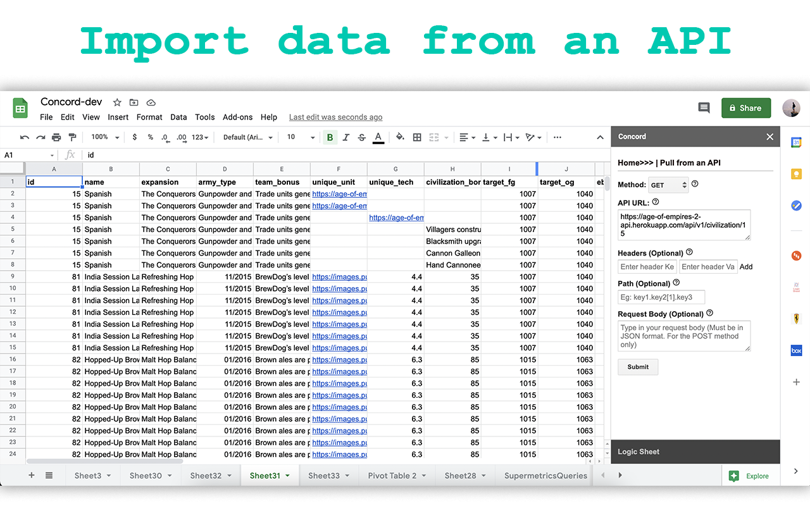

# Logic Sheet documentation

Thanks for using the Logic Sheet Google Workspace add-on. Logic Sheet is an all-in-one data processing tool for Google Sheets. You can use it to pull data from an API, enrich your spreadsheet with an external API, sort your data, and do math.

## Work with APIs
This section will cover how to use Logic Sheet's API-related functions.

### Pull from an API

**Method:** Chose the http method to pull data from an API endpoint. Currently we only support the GET and POST methods, though we will add more. Please check your API reference to decide which method you want to use.

**API url:** Type in the url and full path of the API endpoint, including all parameters. For example: https://mydata.com/api/v2/dataset1?para1=value1&para2=values.

Parameters are usually used to pass in API keys for simple authentication methods.
