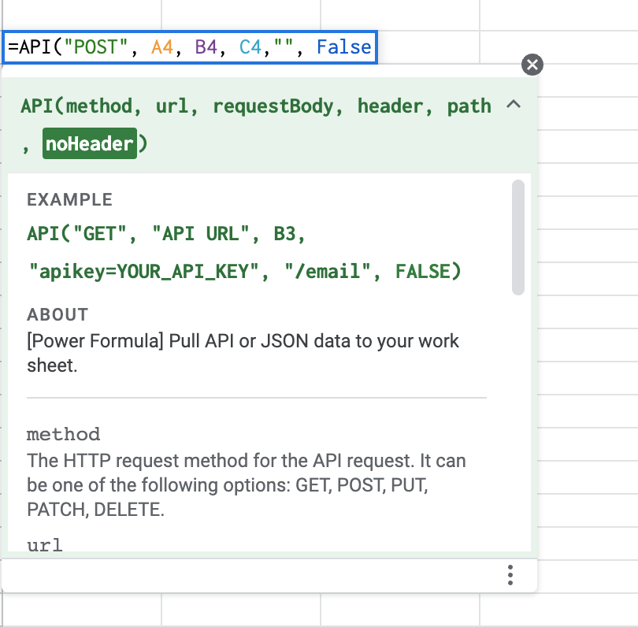
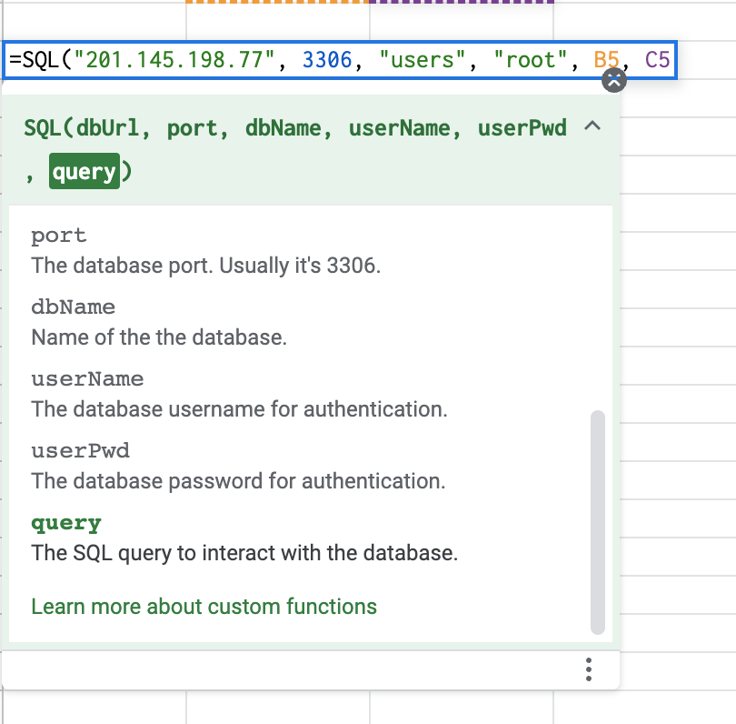
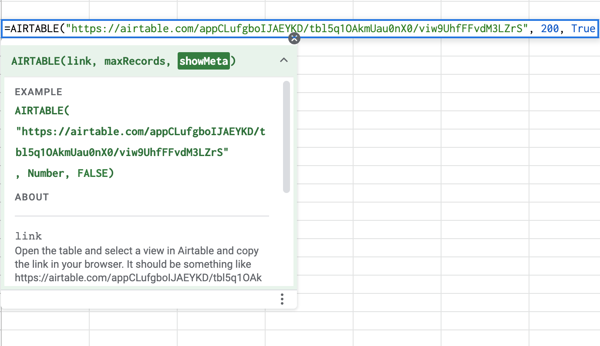
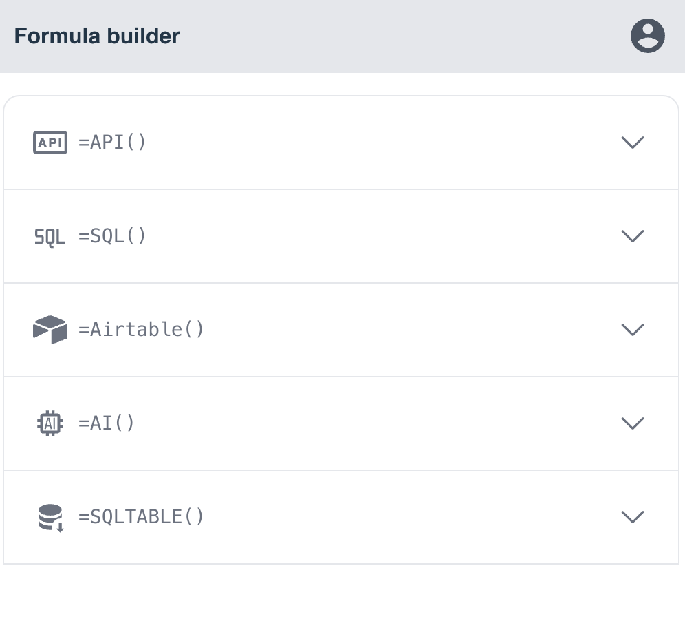

## Power Formulas

Power Formulas provides a set of advanced powerful Google Sheets formulas that boost your spreadsheet productivity.

Power Formulas is designed to help you work smarter, not harder. With =API(), =SQL(), =AI(), and =AIRTABLE(), you'll be able to perform complex tasks in seconds. From automating data collection to creating powerful reports, our formulas will transform the way you work with Google Sheets.

## =API()

The =API() formula allows you to connect your spreadsheet to any API endpoint. This means you can easily integrate data from a wide range of sources, including social media, eCommerce platforms, and more. You can also use it to directly import JSON data, making it simple to work with data in its raw format.

## =SQL()

With the =SQL() formula, you can retrieve data from a variety of databases, including MySQL, Oracle, and Microsoft SQL Server, to Google Sheets. The formula allows you to specify the database you want to connect to and the query you want to run. You can either pull data from a database or send Google Sheets data to a database using SQL queries.

## =AIRTABLE()

The =AIRTABLE() formula allows you to pull data in any Airtable table into Google Sheets and keep the data up to date. This means that if you change data in Airtable, the data in Google Sheets will change automatically.

## Formula Builder

Power Formulas comes with a user-friendly Formula Builder that helps you build your formulas in a graphic users interface.

With the Formula Builder, you can select the formula you want to use from a list of categories, and type in the arguments in a form. The input fields are organized in a logical order, making it easy to understand what each parameter represents. The app will then generate the formulas so that you can copy and paste it in Google Sheets.

#### [Privacy Policy](/privacy)

#### [Terms of Service](/terms)
