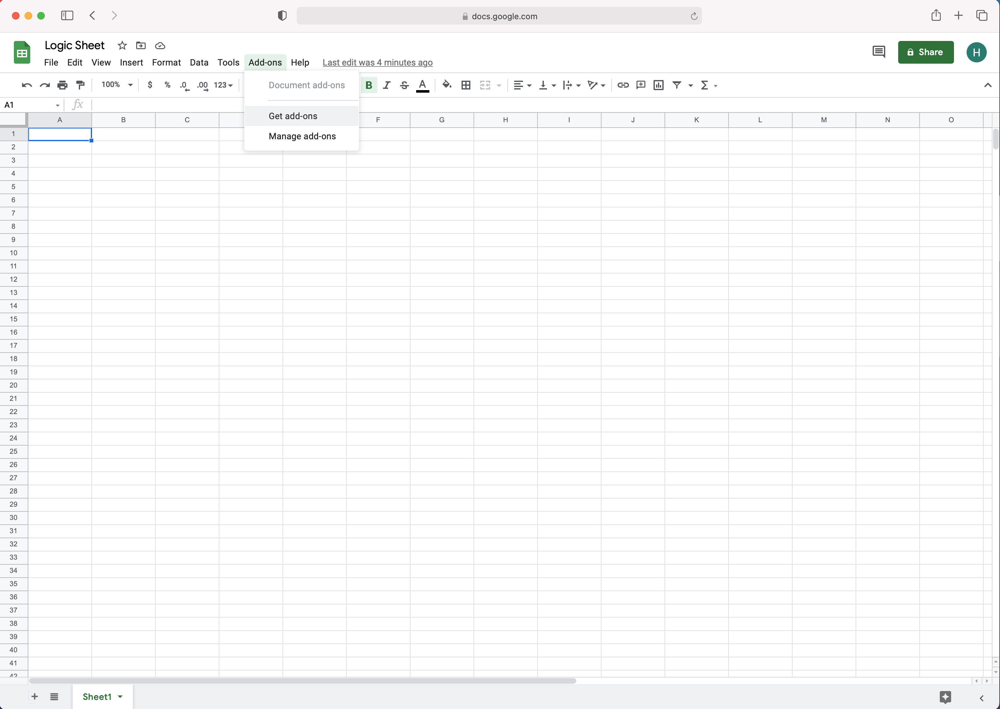
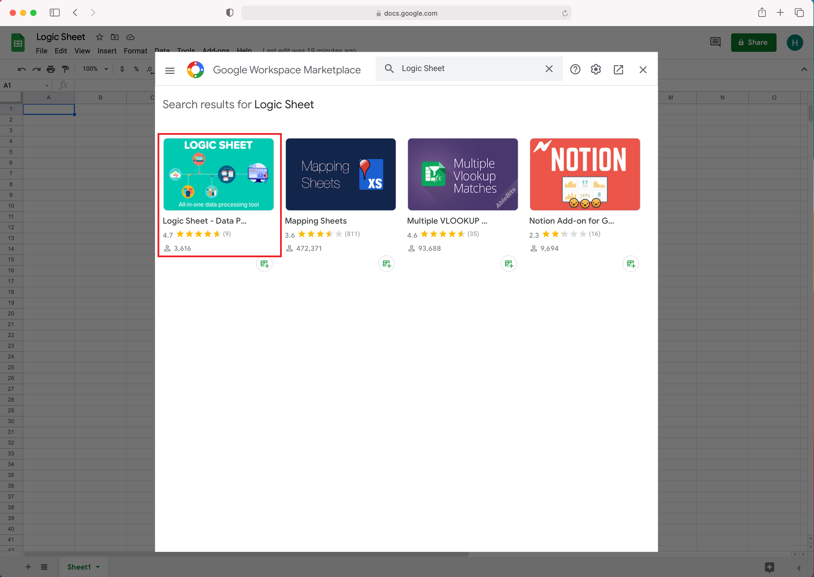
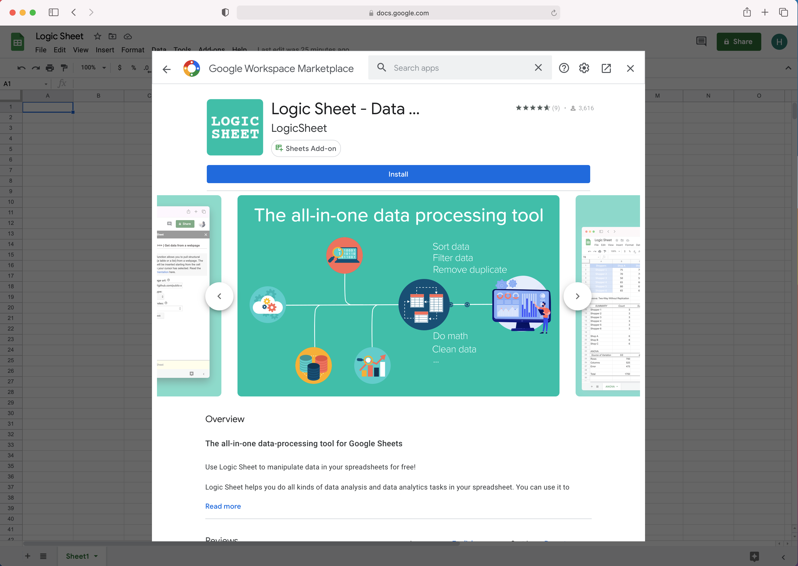
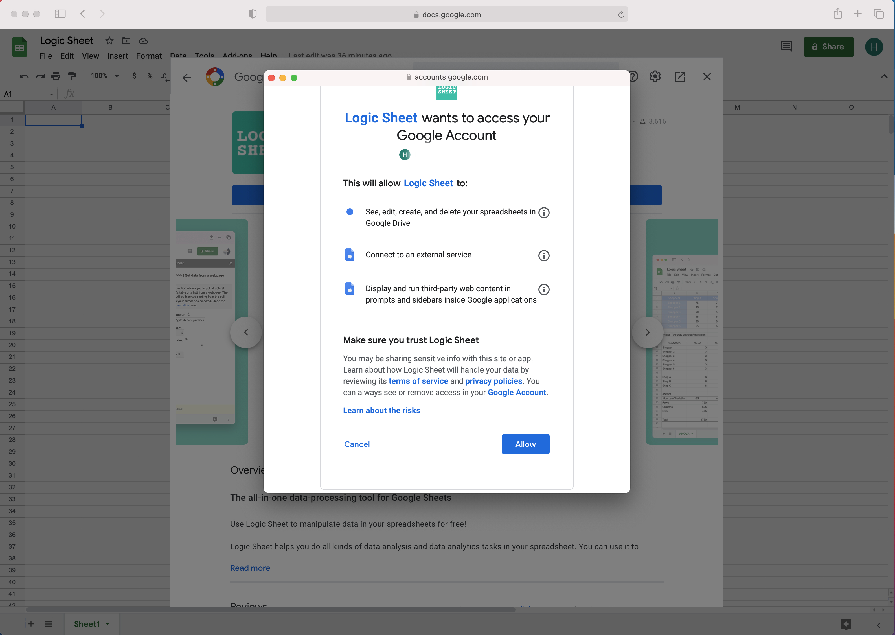
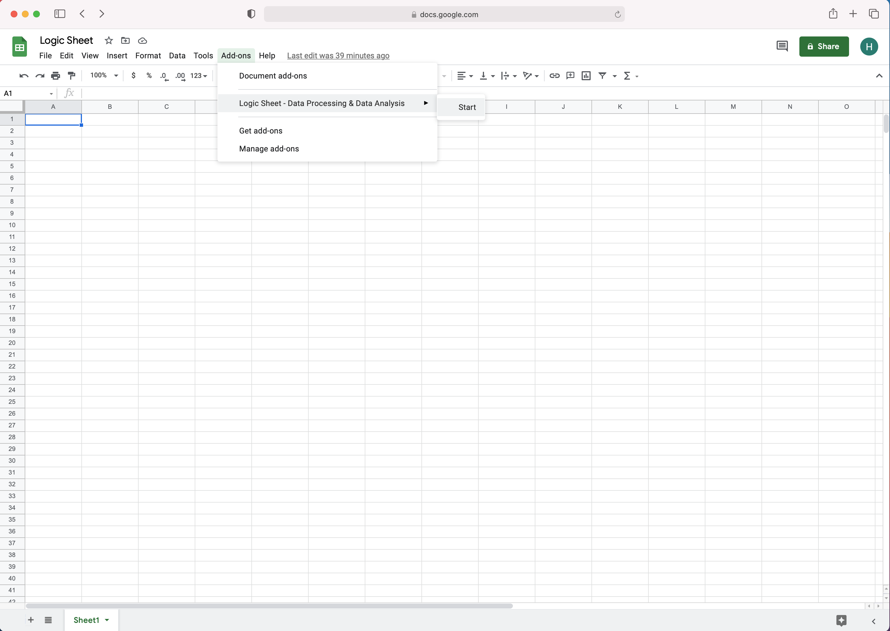
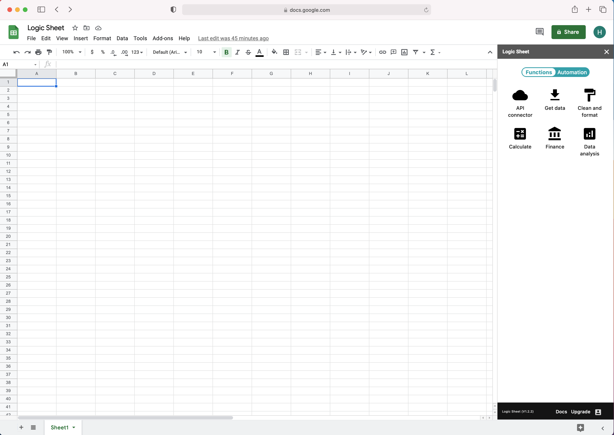

# How to install Logic Sheet

## Overview

Logic Sheet is an add-on for Google Sheets. You can install Logic Sheet from the Google Workspace Marketplace and open it from the Add-on menu at the top mene of your Google Sheets. 

If you already know how to install and use Google Sheets add-ons, you can simply [click here to install Logic Sheet](https://workspace.google.com/marketplace/app/logic_sheet_data_processing_data_analysi/796322869198) and skip the following tutorial.

## Getting started

Open an spreadsheet in Google Sheets, find the Add-on menu at the top menu.

Click "Get add-ons" and open the Google Workspace Marketplace. In the search bar, input "Logic Sheet" and hit search. Select Logic Sheet from the search result.

Click Install and you will be asked to all Logic Sheet to access part of your Google account. Specifically, we ask fro the following permissions:

1. See, edit, create, and delete your spreadsheets in Google Drive.
2. Connect to an external service.
3. Display and run third-party web content in prompts and sidebars inside Google applications.

These permissions are essential for Logic Sheet to perform certain tasks on your behalf. If you have any questions about how we store and use you data, you can refer to our [Privacy Policy](https://app.logicsheet.co/privacy).

Click Allow to complete the installation.

Now you can find Logic Sheet from the Add-ons menu of Google Sheets' top menu. Click Start to open Logic Sheet.

Now you can use Logic Sheet in the sidebar on the right of the screen. For details on how to use all of the functions, check our [documentation](https://app.logicsheet.co/docs).

